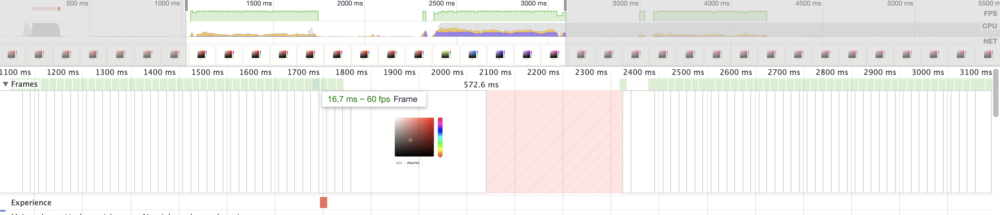

# Colour picker

A colour picker written in react and typescript.

Bundled and compiled using snowpack and deployed to vercel.

[Preview site](https://colour-picker-six.vercel.app/)

# Performance

Uses the GPU to render transforms and uses translate for pointer movement. A combination of this provides a stable 60fps on most machines!

# Testing

Run `yarn test`

Test's are available for a few items mostly for things that are able to test:

- colour conversion functions
- Interaction layer
- Text render

# Running

1. `yarn`
2. `yarn start`
